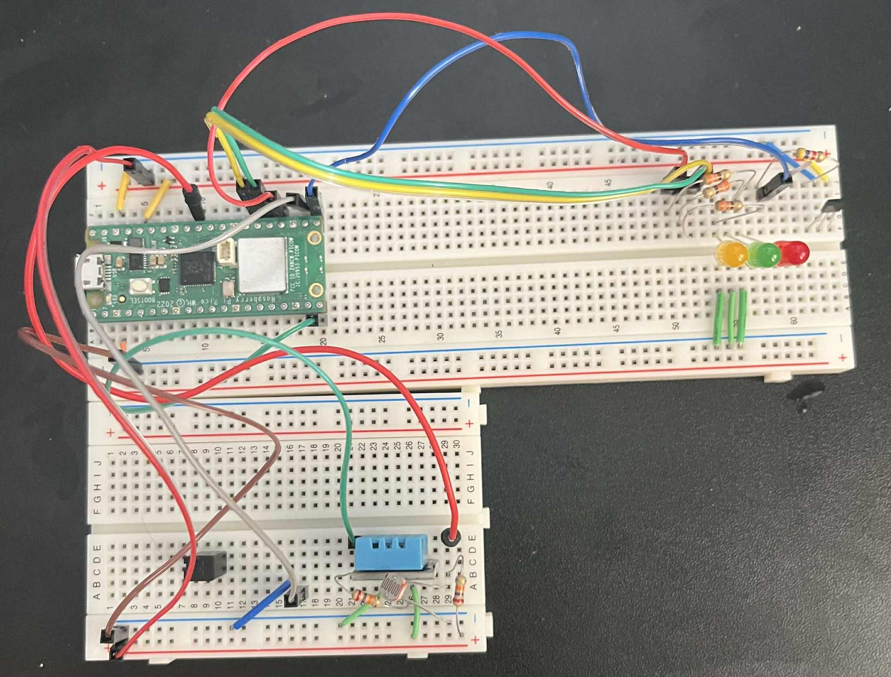
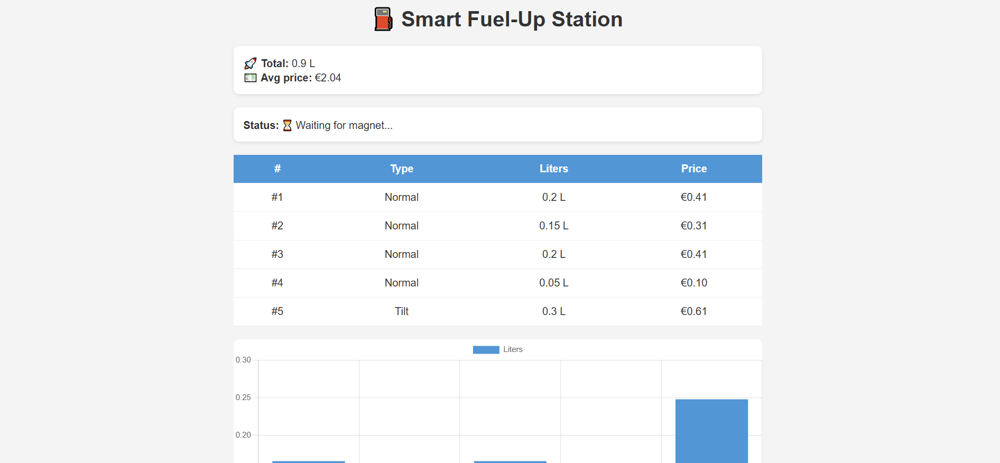

# ⛽ Smart Fuel Station with Dynamic Pricing

**Gellért Szalai (gs223xt)**

This project is a **smart fuel station simulator** that automatically detects when a vehicle starts fueling, measures the duration to estimate liters pumped, and dynamically adjusts the fuel price based on **ambient temperature and light** conditions. 

It uses a Raspberry Pi Pico WH running MicroPython with several sensors (Hall effect, DHT11, photoresistor, tilt switch), and serves a **real-time web dashboard** directly from the Pico. The built-in web server provides live charts, statistics, and CSV export functionality accessible from any device on the network.

For someone familiar with IoT and MicroPython, building this project (including all sensor wiring, web interface code, and dashboard features) might take around **8–10 hours**, factoring in debugging and testing.

---

## Objective

The idea originated from exploring how environmental factors (like heat or sunlight) can impact fuel volatility, safety margins, or even pricing models. 

**Why I chose this project:**
- Combines multiple sensors for real-world simulation
- Explores dynamic pricing based on environmental conditions
- Creates a complete IoT solution with web interface

**What purpose does it serve:**
- Demonstrates automatic detection and measurement systems
- Shows how environmental factors can influence pricing
- Provides safety monitoring with tilt detection
- Creates a self-contained web dashboard for monitoring

**What insights I think it will give:**
- How environmental metrics change during typical operation
- How often anomalies (like excessive tilt) would occur
- What a simple, standalone IoT fuel station interface might look like
- Understanding of sensor integration and web-based IoT dashboards

---

## Material

Here's a list of all materials used:

| Component                     | Purpose                               | Specifications                       |
|--------------------------------|---------------------------------------|--------------------------------------|
| Raspberry Pi Pico WH           | Main controller + WiFi               | MicroPython, 2.4GHz WiFi            |
| Breadboard + jumper wires      | Connect components                   | Standard breadboard, male-male wires |
| TLV49645 Hall effect sensor    | Detect magnet (car present)          | Digital output, 3.3V operation      |
| Magnet                         | Trigger hall sensor                  | Small neodymium magnet               |
| DHT11                          | Read temperature & humidity          | 0-50°C, 20-90% RH, digital output   |
| Photoresistor + 10kΩ resistor  | Measure light level                  | Variable resistance 1kΩ-10MΩ        |
| Tilt switch                    | Detect abnormal orientation          | Mercury/ball switch, digital output  |
| Red, Yellow, Green LEDs + 330Ω | Visual fueling status indicator      | Standard 5mm LEDs, current limiting  |
| Windows laptop                 | Run web browser to view dashboard    | For accessing web interface          |
| Micro-USB cable                | Connect Pico to PC                   | Power and programming                |

All components except the Pico were from a standard electronics starter kit. The Pico WH was chosen specifically for its built-in WiFi capability and MicroPython support.

---

## Computer setup

For this project I used **Thonny** as my IDE. It's particularly convenient for MicroPython development.

**Chosen IDE:** Thonny IDE
- Simple interface for MicroPython
- Direct code execution on device
- No complex setup required

**How the code is uploaded:**
- Connect Pico via USB
- Select "MicroPython (Raspberry Pi Pico)" interpreter
- Click "Run current script" - code executes directly on Pico
- No need to save to flash memory for development

**Steps needed for my computer:**
1. Download and install Thonny IDE
2. Install MicroPython firmware on Pico (if not pre-installed)
3. Connect via USB and select correct interpreter
4. Test connection with simple print statement

The beauty of this setup is its simplicity - no additional drivers, Node.js, or complex installations needed. Just Thonny and a USB cable.

---

## Putting everything together

### Wiring connections:

- **Hall effect sensor:**  
    - `VCC` → 3.3V  
    - `GND` → GND  
    - `OUT` → `GP16`

- **Tilt switch:**  
    - `One side` → `GP17`  
    - `Other side` → GND (internal pull-up in code)

- **DHT11:**  
    - `Data` → `GP15` (with internal pull-up)
    - `VCC` → 3.3V  
    - `GND` → GND

- **Photoresistor voltage divider:**  
    - Between 3.3V and `GP26`
    - `GP26` to GND through 10kΩ resistor

- **LEDs with current limiting:**  
    - Red → `GP18` + 330Ω → GND
    - Yellow → `GP19` + 330Ω → GND  
    - Green → `GP20` + 330Ω → GND

### Circuit considerations:
- All sensors operate at 3.3V logic level
- 330Ω resistors limit LED current to ~10mA (safe for Pico pins)
- Photoresistor uses voltage divider for analog reading
- Pull-up resistors handled in software where possible

This is a breadboard prototype suitable for development and demonstration. For production, I'd design a custom PCB with proper connectors and better mechanical stability.

---

## Platform

I chose to implement everything **directly on the Raspberry Pi Pico** with a built-in web server rather than using external cloud services.

**Platform description:**
- **Web server:** HTTP server running on Pico itself
- **Data storage:** In-memory Python lists and variables
- **Interface:** HTML dashboard with JavaScript charts
- **Connectivity:** WiFi network access

**Why I chose this platform:**
- **Self-contained:** No external dependencies or cloud services
- **Privacy:** All data stays local on the device
- **Simplicity:** Single device solution, easy to deploy anywhere
- **Cost-effective:** No subscription fees or cloud costs
- **Educational:** Shows how to build complete IoT solution from scratch

**Scaling considerations:**
- Current setup handles single fuel station
- Could scale to multiple pumps with MQTT broker
- Data persistence would need external database for production
- Web interface could be enhanced with user authentication

---

## The code

### Core sensor reading and state management:

```python
# Constants for system behavior
FLOW_RATE = 0.05  # Base flow rate in L/s
PRICE_PER_LITER = 1.85  # Base price
SURCHARGE_RATE = 1.10  # 10% surcharge in dark conditions
LIGHT_THRESHOLD = 20000  # ADC threshold for "dark"
TEMP_THRESHOLD = 28  # Temperature threshold in Celsius
```

### Main state machine logic:

```python
# Car detection and fueling start
if hall_sensor.value() == 0 and not fueling:
    fueling = True
    start_time = time.time()
    led_yellow.off()
    led_green.on()
    current_status = "🧲 Magnet detected — Fueling in progress."
```

### Dynamic pricing calculation:

```python
# Environmental factor pricing
try:
    dht_sensor.measure()
    temp = dht_sensor.temperature()
except:
    temp = 25  # Default fallback

# Temperature affects flow rate
adj_flow = FLOW_RATE * 0.9 if temp > TEMP_THRESHOLD else FLOW_RATE
liters = duration * adj_flow

# Light level affects pricing
light_val = photoresistor.read_u16()
is_dark = light_val < LIGHT_THRESHOLD
price_per_liter = PRICE_PER_LITER * SURCHARGE_RATE if is_dark else PRICE_PER_LITER
price = liters * price_per_liter
```

### Web server data API:

```python
# JSON API for dashboard updates
json_data = '{' + \
    f'"status":"{current_status}",' + \
    f'"totalLiters":{total_liters:.2f},' + \
    f'"avgPrice":{avg_price:.2f},' + \
    f'"labels":[{",".join(labels_list)}],' + \
    f'"liters":[{",".join(liters_list)}],' + \
    f'"tilt":{tilt_stops},' + \
    f'"normal":{normal_stops}' + \
'}'
```

The code uses a simple state machine approach, checking sensors in a main loop and updating the web interface with current status and historical data.

---

## Transmitting the data / connectivity

**Data transmission method:**
- **Local network:** WiFi connection to local router
- **Protocol:** HTTP web server on port 80
- **Data format:** JSON API and HTML responses
- **Update frequency:** Dashboard polls every 3 seconds

**Wireless protocols used:**
- **WiFi 802.11n:** For network connectivity
- **HTTP:** For web server communication
- **No external protocols:** Everything handled locally

**Data package format:**
```json
{
  "status": "🎉 Fueling complete. Nice job!",
  "totalLiters": 2.45,
  "avgPrice": 1.95,
  "labels": ["#1", "#2", "#3"],
  "liters": [1.2, 0.8, 0.45],
  "types": ["Normal", "Normal", "Tilt"],
  "prices": ["€2.22", "€1.48", "€0.83"]
}
```

**Design choices:**
- **Local-first approach:** No internet dependency, works on isolated networks
- **Low power consumption:** Only transmits when requested (not continuously)
- **Simple protocols:** HTTP is universally supported by all devices
- **Real-time updates:** 3-second polling provides near real-time experience

---

## Presenting the data

The dashboard runs directly on the Pico's web server and is accessible via any web browser at the device's IP address.

### Dashboard features:
- **Real-time status display:** Current fueling state and progress
- **Session history table:** Last 5 fueling sessions with details
- **Statistics summary:** Total liters pumped and average price per liter
- **Interactive bar chart:** Liters per session using Chart.js
- **Pie chart:** Breakdown of normal vs tilt-stopped sessions
- **CSV export:** Download complete fueling history
- **Confetti celebrations:** Animation when fueling completes successfully

### Data storage:
- **Format:** Python lists and dictionaries in memory
- **Retention:** Data persists during session (lost on device restart)
- **Capacity:** Stores all sessions since startup, displays last 5 in charts
- **Export:** Full history available via CSV download

### Database choice:
I chose in-memory storage for simplicity and demonstration purposes. For production, I would implement:
- **SQLite** for local persistent storage
- **InfluxDB** for time-series data if scaling to multiple devices
- **Local file backup** for session persistence across reboots

**Data update frequency:** Dashboard automatically refreshes every 3 seconds to show live status updates.

---

## Finalizing the design

### 🎉 Final results:

The project successfully demonstrates a complete IoT fuel station simulator with:
- ✅ Automatic vehicle detection via Hall sensor
- ✅ Environmental factor pricing (temperature + light)
- ✅ Safety monitoring with tilt detection
- ✅ Real-time web dashboard with charts
- ✅ CSV data export functionality
- ✅ LED status indicators and celebrations

### What went well:
- Sensor integration worked reliably
- Web server performed smoothly on the Pico
- Dynamic pricing logic responded correctly to environmental changes
- Dashboard provided intuitive user experience

### What could be improved:
- **Data persistence:** Add local storage for session data
- **Real flow sensor:** Replace time-based calculation with actual flow measurement
- **User authentication:** Secure the web interface
- **Mobile optimization:** Improve dashboard responsiveness on mobile devices
- **MQTT integration:** Enable multiple pump coordination

### Pictures:
### Hardware Wiring


### Web Dashboard


The project exceeded my expectations for what's possible with a simple microcontroller and demonstrates how powerful modern IoT development can be with the right tools and approach.

**Final thoughts:** This project showcases the potential of edge computing in IoT - everything runs locally, no cloud dependencies, yet provides a rich interactive experience. Perfect foundation for exploring more advanced IoT concepts!